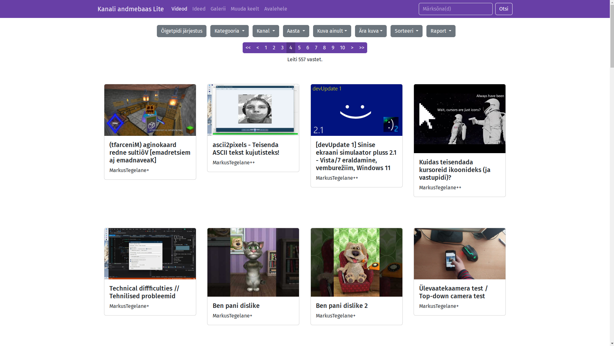

# Kanali andmebaas Lite

Minimaalne versioon kanali andmebaasist, mis on kirjutatud Yii2 raamistikus.

Projekti struktuur
-------------------

      assets/             contains assets definition
      commands/           contains console commands (controllers)
      config/             contains application configurations
      controllers/        contains Web controller classes
      helpers/            contains helper functions
      mail/               contains view files for e-mails
      models/             contains model classes
      runtime/            contains files generated during runtime
      tests/              contains various tests for the basic application
      vendor/             contains dependent 3rd-party packages
      views/              contains view files for the Web application
      web/                contains the entry script and Web resources

Nõuded
------------

- PHP 7.4 või uuem
- Composer

Paigaldamine
------------
1. Panna püsti WAMP, LAMP või MAMP server
2. Konfigureerida andmebaas ja meelde jätta andmebaasi logimisandmed
3. Laadi alla composer ja paigalda see ([getcomposer.org](https://getcomposer.org))
4. Pane projekt veebiserveri juurkataloogi ja channel_db_lite alamkataloogis käivita `composer install`
5. `config` kataloogis loo **db.php** fail, kopeeri sinna **db_sample.php** sisu
6. Muuda db.php sisu
    - Asenda **DATABASE** andmebaasi nimega
    - **localhost** andmebaasi hostinimega (kui samas serveris, siis localhost sobib)
    - Asenda **USERNAME** andmebaasi kasutajanimega
    - Asenda **PASSWORD** andmebaasi parooliga
7. Loo web-is alamkataloogid **gallery_/logos** ja **thumbs** või loo symlink **gallery_** ja **thumbs** jaoks symlinkid vastavatesse vana andmebaasi alamkataloogidesse (nt *channel_db/gallery* ja *channel_db/thumbs*)
8. Olge kindlad, et thumbs kataloogil oleks kirjutamisõigus

Andmete muutmine
-------------
Selleks, et tekstilisi andmeid muuta, peate püsti panema markusmaal.ee veebiserveri minimaalse konfiguratsiooniga. Lisainfo [siin](https://github.com/MarkusMaal/www). Seejärel, saate andmeid muuta admin keskkonnas "Kanali andmebaasid" lehelt, mille leiate "Globaalse" menüü alt.

### Pisipildid
Kanali andmebaas Lite laeb automaatselt alla pisipildid YouTube-i kaudu. Kui soovite käsitsi lisada videole pisipildi, lisage thumbs kausta pilt nimega `<video ID>.jpg` (nt 1.jpg, 213.jpg jne).

### Kanali logod galeriis
Logod tuleb käsitsi lisada kataloogi `@web/gallery_/<kanali ID>`. Logofailid ise on nimetatud järgmises formaadis: `<jrk nr>.png`.